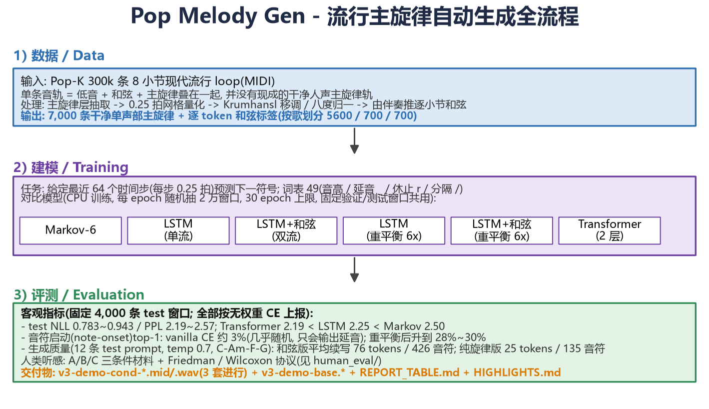
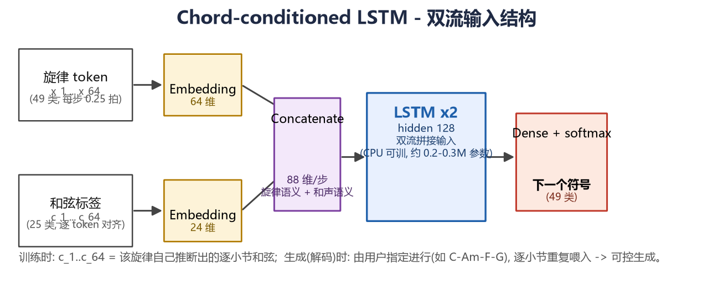

# Pop Melody Gen — Chord-conditioned generation of modern pop lead melodies

A small but rigorous symbolic-music-generation study, fully reproducible on CPU (Windows):
from 305k noisy Pop-K MIDI loops to clean monophonic lead melodies, then LSTM/Transformer
next-token models with an honest by-song split and a class-rebalanced objective.



## Problem & idea
- Task: continue (or write from a motif) a **pop lead melody under a user-chosen chord
  progression** (e.g., C–Am–F–G).
- Public "pop MIDI" loops are not clean monophonic leads: bass + chords + lead live on one
  track. And when melodies are tokenized on a 16th-note grid, vanilla cross-entropy rewards
  the lazy solution "always output hold `_` / separator `/`": measured note-onset top-1
  accuracy drops to ≈3% (≈ random) and sampling never emits new notes.
- Our fix: melody-layer extraction + per-bar chord inference, then **note-onset reweighting
  (λ=6) in training**, plus fair comparison to Markov-6 / LSTM / chord-LSTM / Transformer.

## Pipeline
1. `preprocess_v3.py`: extract monophonic lead from polyphonic loops, quantize to 16ths,
   normalize key/octave, infer per-bar chords from the accompaniment → 7,000 melodies +
   per-token chord labels; 8:1:1 by-song split (5600/700/700).
2. `train_exp.py`: single-stream LSTM, dual-stream LSTM (melody tokens + chord labels),
   2-layer Transformer; 20k sampled windows/epoch, 30 epochs max, early stop + LR decay;
   fixed validation/test windows are shared and cached so all models are compared fairly.
3. `analyze.py` + `eval_v3.py`: per-token metrics by ground-truth type (note/hold/rest/sep),
   generation metrics over 12 fixed test prompts (length, note count, repetition, entropy,
   range, harmonic fit) → `REPORT_TABLE.md` + `experiments/summary.json`.
4. `human_eval/`: A/B/C listening stimuli (A = real melody, B = LSTM, C = chord-LSTM) plus a
   Friedman/Wilcoxon analysis script.

## Headline results (CPU, seed 1)
- Test NLL on the same 4,000 windows: Transformer 0.783 < LSTM 0.809 < Markov-6 0.916
  (PPL 2.19 / 2.25 / 2.50).
- Note-onset top-1 accuracy: vanilla CE ≈2–3%; **reweighted LSTM 28% and chord-LSTM 30%**.
- Under C–Am–F–G over 12 test prompts, the rebalanced chord model keeps writing much longer
  melodies: avg 76 tokens / 426 notes vs 25 tokens / 135 notes for the plain model, with a
  wider range (9.9 vs 6.2 semitones) and richer pitch entropy (2.0 vs 1.6 bits).
- Rendering: `v3-demo-cond-C-Am-F-G.wav/.mid` etc. give three progressions; `v3-demo-base` is
  the no-chord control.


## Pretrained models (in this repo)

No need to retrain — the five released checkpoints are in `experiments/`:

| file | notes | test NLL |
|---|---|---|
| `xf_s1.keras` | 2-layer Transformer (vanilla CE) | 0.783 |
| `base_s1.keras` | single-stream LSTM (vanilla CE) | 0.809 |
| `cond_s1.keras` | dual-stream LSTM + chords (vanilla CE) | 0.824 |
| `base_r1.keras` | single-stream LSTM (note-reweighted 6x) | 0.940 |
| `cond_r1.keras` | dual-stream LSTM + chords (note-reweighted 6x, main demo model) | 0.943 |

> Vanilla-CE models score a lower NLL but sampling barely attacks new notes; the reweighted
> `_r1` models are the ones that actually compose. Render demos directly:

```powershell
& $PY generate_v3.py --base-model base_r1 --cond-model cond_r1 --temperature 0.7
```

`generate_v3.py` / `eval_v3.py` / `analyze.py` read these files by default; the Transformer is
deserialized through `models_v3.TransformerLM`.

Dual-stream architecture:



## Reproduce
```powershell
$PY = "C:\Users\lzq13\melody-rnn-lstm\.venv\Scripts\python.exe"
# the raw Pop-K corpus (CC BY-NC) is NOT committed — fetch it first (~54 MB)
& $PY scripts\download_dataset.py
& $PY preprocess_v3.py
& $PY train_exp.py --kind base --name base_r1 --seed 1 --note-weight 6
& $PY train_exp.py --kind cond --name cond_r1 --seed 1 --note-weight 6
& $PY train_exp.py --kind xformer --name xf_s1 --seed 1
& $PY analyze.py
& $PY eval_v3.py --num-seeds 12 --num-steps 160 --temperature 0.7
& $PY generate_v3.py --base-model base_r1 --cond-model cond_r1 --temperature 0.7
```

## Honest limitations
- Rebalanced models trade ~0.13 test NLL for generative behavior; standard NLL alone
  under-reports quality for grid-token melody models.
- Melodies are phrase-level: full song form (verse/chorus structure) is not modeled.
- 12-seed generation numbers and the listening protocol give effect directions, not
  paper-grade significance (HUMAN_EVAL targets N ≥ 20 raters).

License: dataset Pop-K CC BY-NC; our code MIT. See CITATIONS.bib.

## Acknowledgements

This project started as a from-scratch reimplementation of Valerio Velardo's tutorial
[musikalkemist/generating-melodies-with-rnn-lstm](https://github.com/musikalkemist/generating-melodies-with-rnn-lstm)
(Generating Melodies with RNN-LSTM, MIT License, The Sound of AI). We then extended it with
sampling improvements (temperature / top-p / repetition penalty), a dual-stream
chord-conditioned LSTM, a 2-layer Transformer baseline, and our own pop-corpus pipeline
(noisy MIDI loops -> clean monophonic lead + chord labels). Thanks to the original author
and the community.
